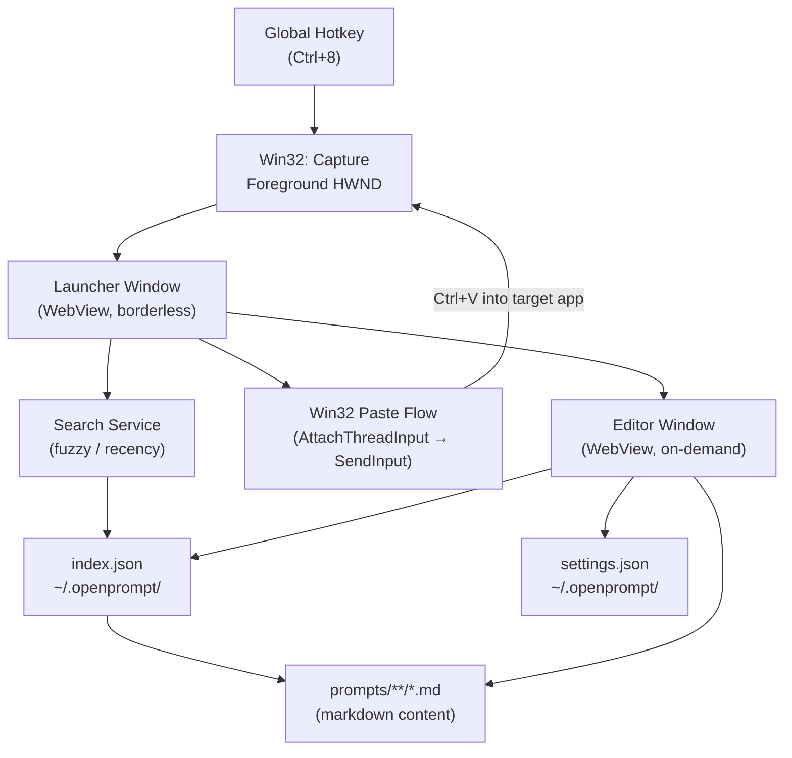
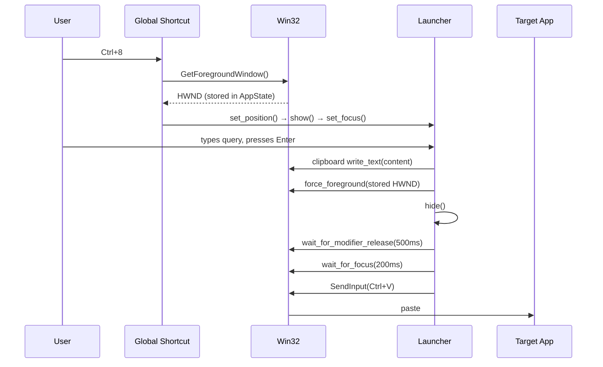
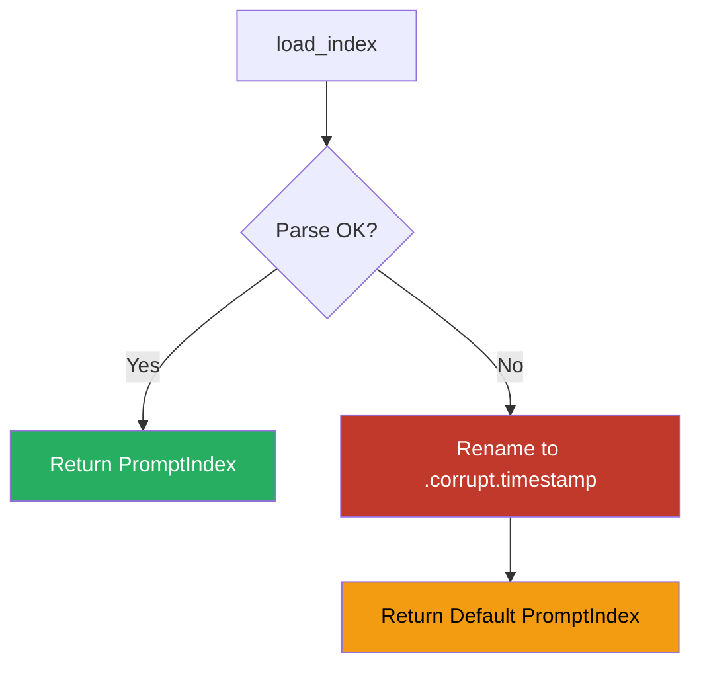

# OpenPrompts

A Windows desktop app for storing, searching, and instantly pasting AI prompts into any application. Press a global hotkey from anywhere: a borderless launcher appears, you fuzzy-search your library, hit Enter, and the selected prompt is pasted into the previously active window.

---

## Architecture



**Two-window model:**
- **Launcher** — defined in `tauri.conf.json`, pre-created but hidden (`visible: false`). Shown/hidden by the hotkey, never destroyed.
- **Editor** — created on demand via `WebviewWindowBuilder` when the user opens it, destroyed on close.

---

## Technology Stack

| Layer | Technology | Version |
|-------|-----------|---------|
| Desktop framework | Tauri | 2.x |
| Frontend | React + TypeScript | 19.1 / 5.8 |
| Bundler | Vite | 7.x |
| State management | Zustand | 5.x |
| Markdown editor | Native `<textarea>` | Built-in |
| Icons | lucide-react | 0.555 |
| Win32 APIs | windows crate | 0.58 |
| Async runtime | tokio | 1.x |
| Mutex | parking_lot | 0.12 |
| Serialization | serde / serde_json | 1.x |

---

## Project Structure

```
open-prompts/
├── src/                          # React frontend
│   ├── App.tsx                   # Routes by window label (launcher / editor)
│   ├── types/index.ts            # TypeScript mirrors of all Rust structs
│   ├── services/ipc.ts           # Typed invoke() wrappers for all 21 commands
│   ├── stores/
│   │   ├── editorStore.ts        # Prompt CRUD + 500ms auto-save debounce
│   │   ├── launcherStore.ts      # Search, selection, paste/copy/dismiss actions
│   │   └── settingsStore.ts      # Settings load/save
│   ├── windows/
│   │   ├── launcher/             # LauncherApp, SearchInput, ResultList, ContextMenu
│   │   └── editor/               # EditorApp, Sidebar, PromptForm, MarkdownEditor, SettingsPanel
│   └── styles/
│       ├── global.css            # CSS variables, dark + light themes
│       ├── launcher.css          # Launcher panel styles + animations
│       └── editor.css            # Editor layout + settings panel
│
└── src-tauri/                    # Rust backend
    ├── src/
    │   ├── lib.rs                # Tauri setup, plugin registration, command wiring
    │   ├── state.rs              # AppState (StoragePaths, last HWND, current hotkey)
    │   ├── error.rs              # AppResult<T> = Result<T, String>
    │   ├── models/               # PromptMetadata, Prompt, FolderMeta, PromptIndex, AppSettings
    │   ├── services/             # storage, index, prompt, settings, seed, search
    │   ├── commands/             # data, settings, windows, hotkey (Tauri #[command])
    │   └── platform/windows.rs  # Win32 API layer (cfg(windows) only)
    ├── tauri.conf.json           # Window config, bundle settings
    └── capabilities/default.json # Single capability file for both windows
```

---

## Core Flows

### Hotkey → Paste



**Critical ordering:** `force_foreground` is called *before* `hide()` — hiding the launcher first would forfeit foreground privilege and UIPI would block `SendInput`.

### Index Corruption Recovery



---

## Data Storage

All data is stored locally — no network, no sync.

| File | Location | Format |
|------|----------|--------|
| Prompt index | `~/.openprompt/index.json` | JSON |
| Prompt content | `~/.openprompt/prompts/<folder>/<name>.md` | Markdown |
| Settings | `~/.openprompt/settings.json` | JSON |

**Atomic writes:** all file mutations write to a `.tmp` file first, then rename — safe on NTFS and crash-resistant.

**Filename sanitization:** strips Windows reserved characters (`< > : " / \ | ? *`), reserved device names (`CON`, `NUL`, `COM1`–`COM9`, `LPT1`–`LPT9`), and resolves collisions with a `-N` numeric suffix.

---

## IPC Commands

| Command | Handler | Description |
|---------|---------|-------------|
| `get_index` | data | Full index with folder list |
| `get_folders` | data | Folder names only |
| `get_prompt` | data | Metadata + markdown content |
| `save_prompt` | data | Create or update prompt + index |
| `delete_prompt` | data | Remove from index then delete file |
| `add_folder` | data | Create folder entry |
| `rename_folder` | data | Rename folder across all prompts |
| `delete_folder` | data | Remove folder and all its prompts |
| `search_prompts` | data | Fuzzy search (empty → recency sort) |
| `record_usage` | data | Increment use_count + set last_used |
| `get_settings` | settings | Load settings.json |
| `save_settings` | settings | Write settings.json |
| `paste_and_dismiss` | windows | Full paste flow (clipboard → focus → SendInput) |
| `dismiss_window` | windows | Hide launcher |
| `copy_to_clipboard` | windows | Clipboard write only |
| `open_editor_window` | windows | Create or focus editor |
| `close_editor_window` | windows | Destroy editor window |
| `get_current_hotkey` | hotkey | Current accelerator string |
| `set_hotkey` | hotkey | Unregister old, register new |
| `pause_hotkey` | hotkey | Unregister (for hotkey recorder UI) |
| `resume_hotkey` | hotkey | Re-register current hotkey |

---

## Getting Started

### Just want to run it?

From the repository root:

```powershell
cd open-prompts
npm install
npm run tauri build
```

This compiles everything and produces a Windows installer at:

```
src-tauri/target/release/bundle/nsis/OpenPrompts_<version>_x64-setup.exe
```

Run that installer once — after that, OpenPrompts is installed like any other app. No terminal needed again. To uninstall, use **Settings → Apps** (Add or Remove Programs) — the NSIS installer registers a standard uninstaller there.

> **Prerequisite:** [Node.js](https://nodejs.org/) LTS (18+; 20+ recommended with Vite 7), [Rust](https://rustup.rs/) stable, and [WebView2](https://developer.microsoft.com/en-us/microsoft-edge/webview2/) (already present on Windows 11). The build takes a few minutes the first time while Rust compiles dependencies.

### Development (live reload)

From the repository root:

```powershell
cd open-prompts
npm install
npm run tauri dev
```

The app starts with no visible window. Press **Ctrl+8** to open the launcher.

---

## Usage

| Action | How |
|--------|-----|
| Open launcher | **Ctrl+8** from any app |
| Search prompts | Type in the launcher search box |
| Navigate results | **↑ / ↓** arrow keys |
| Paste into active app | **Enter** |
| Copy to clipboard only | Right-click → *Copy to clipboard* |
| Open prompt in editor | Right-click → *Open in editor* |
| Dismiss launcher | **Escape** |
| Open editor directly | **Ctrl+E** from launcher |
| Save prompt in editor | **Ctrl+S** or auto-saves after 500ms idle |
| Change hotkey | Editor → gear icon → Settings → Global Hotkey |

### Hotkey Format

Hotkeys use Electron-style accelerator strings: `CommandOrControl+<key>`, e.g. `CommandOrControl+8`, `CommandOrControl+Shift+P`. The hotkey recorder in Settings captures the combo and calls `pause_hotkey` while recording so the shortcut does not fire during capture.

---

## Settings

Settings are stored at `~/.openprompt/settings.json`.

| Setting | Default | Description |
|---------|---------|-------------|
| `general.hotkey` | `CommandOrControl+8` | Global hotkey accelerator |
| `general.editorAlwaysOnTop` | `true` | Keep editor above other windows |
| `general.autoLaunch` | `false` | Launch at Windows startup *(not yet implemented)* |
| `general.welcomeScreenDismissed` | `false` | Tracks whether first-run welcome UI is dismissed |
| `appearance.theme` | `dark` | `dark`, `light`, or `auto` |
| `appearance.accentColor` | `avocado` | Theme accent (visual only) |

---

## First Run Behavior

- On first launch, if no prompts exist, the app seeds a small starter set of prompts (currently three).
- Seeding runs once and is tracked by `index.seeded` in `~/.openprompt/index.json`.
- Existing prompt libraries are not overwritten.

---

## Configuration

- No `.env` file or external API credentials are required.
- OpenPrompts stores everything locally under `~/.openprompt/`.

---

## Platform Notes

- **Windows only.** The paste flow (`AttachThreadInput`, `SendInput`, `GetAsyncKeyState`) is gated behind `#[cfg(target_os = "windows")]`. The Rust code will compile on other platforms but paste will be a no-op.
- `parking_lot::Mutex` is used throughout instead of `std::sync::Mutex` — it does not poison on panic, which is important since Tauri command handlers run on worker threads.
- The launcher window is positioned on the same monitor as the previously active window using `MonitorFromWindow` + `GetMonitorInfoW`.

---

## Recommended IDE Setup

- [VS Code](https://code.visualstudio.com/) + [Tauri](https://marketplace.visualstudio.com/items?itemName=tauri-apps.tauri-vscode) + [rust-analyzer](https://marketplace.visualstudio.com/items?itemName=rust-lang.rust-analyzer)
